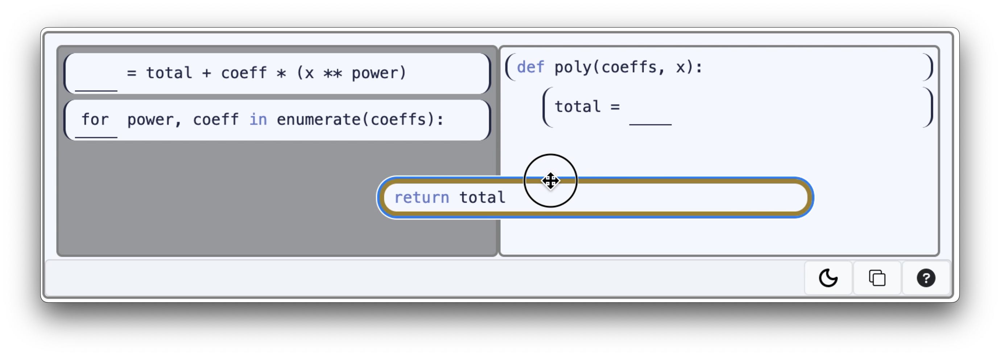

<!-- todo: prairielearn, adoption, fppgen -->
## Automatic Generation of <br> Faded Parsons Problems
#### **Serena Caraco**, *Nelson Lojo*, <br> Michael Verdicchio, Armando Fox


---
<!-- .slide: data-auto-animate -->
## 60 Second Talk
- Teaching Good Habits is Hard
- Faded Parsons Problems help
- **FPPgen** makes Authoring FPPs easy

+++
<!-- .slide: data-auto-animate -->
## 60 Second Talk

- Strong Test Writing is a Good Habit
- **FPPgen** can scale scaffolding and <br> support broad dependencies
- **Mutation-Based Autograders** can <br> grade Test Suites

+++
<!-- .slide: data-auto-animate -->
## 60 Second Talk

*Regardless of students' skill-levels, <br> FPPgen can help you.*

---
<!-- .slide: data-auto-animate -->

> I am not a great programmer, <br>
> I am a good programmer <br>
> with great habits.

*Kent Beck*
<!-- .element: class="fragment fade-in" -->

*How do we impart good habits?*
<!-- .element: class="fragment fade-in" -->

---
<!-- .slide: data-auto-animate -->

``` py
def isEven(n: int):
    # your recursive code here.
```

+++
<!-- .slide: data-auto-animate -->

``` py
def isEven(n: int):
    # think: what's the base case here?
    if base_case:
        return True
    # solve the rest with recursion!
```

+++
<!-- .slide: data-auto-animate -->

``` py
def isEven(n: int):
    if n == 0:
        return True
    else if isEven(n - 1) == False:
        return False
    else if isEven(n - 2) == True:
        return True
    elif isEven(n - 3) == False:
        return False
    else if isEven(n - 4) == True:
        return True
    else if isEven(n - 5) == False:
        return False
    else if isEven(n - 6) == True:
        return True
    else if isEven(n - 7) == False:
        return False
    else if isEven(n - 8) == True:
        return True
    else if isEven(n - 9) == False:
        return False
```

*How do we impart good habits?*
<!-- .element: class="fragment fade-in" -->

+++
<!-- .slide: data-auto-animate -->

*How do we impart good habits?*

### Faded Parsons Problems

---
<!-- .slide: data-auto-animate -->

### Faded Parsons Problems
#### An Example


Note: Guiding idea: force expert solution reconstruction.

+++
<!-- .slide: data-auto-animate -->

### Faded Parsons Problems
#### Another Example



Note: Guiding idea: force expert solution reconstruction.

+++
<!-- .slide: data-auto-animate -->

### Faded Parsons Problems
*Do they work?*

At Least as Effective as Code-Writing
<!-- .element: class="fragment fade-in" -->
Designed for Picking Up Good Habits
<!-- .element: class="fragment fade-in" -->

Note: \*citation needed

---
<!-- .slide: data-auto-animate -->

### Faded Parsons Problems

*Can I actually use this?*

- It must be autogradable.
<!-- .element: class="fragment fade-in" -->
- It must not be meaningully harder to <br> author than a code writing problem.
<!-- .element: class="fragment fade-in" -->

---
<!-- .slide: data-auto-animate -->
### Authoring Experience

> The No-Compromises Approach to Bettering Your Authoring UX

Let's start with Converting to FPPs.
<!-- .element: class="fragment fade-in" -->

+++
<!-- .slide: data-auto-animate -->
### Converting to <span class="invis">Faded</span> Parsons Problems

1. Start with your Code Writing Exercise.
<!-- .element: class="fragment fade-in" -->
2. Run FPPgen.
<!-- .element: class="fragment fade-in" -->
3. Done.
<!-- .element: class="fragment fade-in" -->

+++
<!-- .slide: data-auto-animate -->
### Converting to Faded Parsons Problems

1. Start with your Code Writing Exercise.
2. Mark `?Blanks?`.
3. Run FPPgen.
4. Done.

*No-Compromises?*
<!-- .element: class="fragment fade-in" -->
💯
<!-- .element: class="fragment fade-in" -->


+++
<!-- .slide: data-auto-animate -->

*Yeah, okay. What about...*

### Authoring From Scratch

First, a recap of authoring Code Writing problems.
<!-- .element: class="fragment fade-in" -->


+++
<!-- .slide: data-auto-animate -->
### Code Writing From Scratch

1. Use PrairieLearn to Generate Templates.
1. Rewrite the Question Config.
1. Update the Server File.
1. Write Your Prompt (XML).
1. Write Your Question (XML).
1. Write Your Solution.
1. Write Your Spec.

Note: PL testing grades against your solution with a Spec-Based Autograder.

+++
<!-- .slide: data-auto-animate -->
### Faded Parsons From Scratch

1. Write your Prompt.
1. Write your Solution.
1. Write your Spec.
1. Run FPPgen.

*Better than No-Compromises: <br> FPPgen is Win-Win*
<!-- .element: class="fragment fade-in" -->

Note: prompt embellishment, solution presentation.

---
<!-- .slide: data-auto-animate -->

### Common Misconception

> While useful for beginners, <br>
> FPPs are an impractical medium
> for teaching software engineering.
<!-- .element: class="bad" -->


*This is cool, but aren't blocks for babies?*
<!-- .element: class="fragment fade-in" -->

<hr>

I'll do you one better.
<!-- .element: class="fragment fade-in" -->

---
<!-- .slide: data-auto-animate -->
### Students *must* learn test writing.

#### Difficult to Scaffold.
<!-- .element: class="fragment fade-in" -->
#### Even Harder to Grade.
<!-- .element: class="fragment fade-in" -->

+++
<!-- .slide: data-auto-animate -->

#### Difficult to Scaffold.

*How do we impart good habits?*
<!-- .element: class="fragment fade-in" -->
### Faded Parsons Problems <span class="fragment fade-in">++</span>
<!-- .element: class="fragment fade-in" -->
